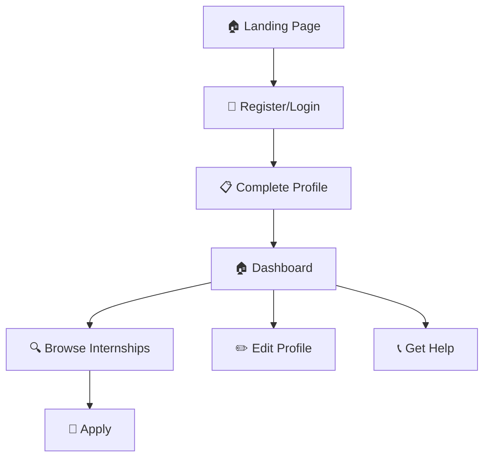

# 🎆 NavDisha-Interns: Complete PM Internship Scheme Platform

<div align="center">


**A comprehensive web application for PM Internship Scheme with AI-powered recommendations**

[Quick Start](#-quick-start) • [Features](#-features) • [Demo](#-demo) • [Documentation](#-documentation)

</div>

## 🌟 Overview

NavDisha-Interns is a full-featured web application designed specifically for the PM Internship Scheme. It helps rural and urban youth across India find relevant internship opportunities through an intelligent recommendation system. The platform is optimized for mobile devices and works efficiently in low-connectivity areas.

### 🎯 Key Objectives
- **Bridge Digital Divide**: Simple interface for first-generation learners
- **Smart Recommendations**: AI-powered matching of candidates with internships
- **Mobile-First**: Optimized for rural areas with low connectivity
- **Complete Solution**: End-to-end internship discovery and application system

## ⚡ Quick Start

```bash
# 1. Clone the repository
git clone https://github.com/harjot008/NAVHAM.git
cd NAVHAM
git checkout Complete-project

# 2. Set up virtual environment
python -m venv navham_env
source navham_env/bin/activate  # On Windows: navham_env\Scripts\activate

# 3. Install dependencies
pip install -r requirements.txt

# 4. Run the application
python app.py

# 5. Open browser
# Go to: http://localhost:5000
```

**That's it! 🎉 Your PM Internship platform is ready!**

## 🎆 Features

### 🔐 Authentication System
- ✅ **Secure Registration**: Email-based signup with validation
- ✅ **Protected Login**: SHA-256 password encryption
- ✅ **Session Management**: Automatic logout and security

### 📋 Smart Profile System
- ✅ **3-Step Form**: Progressive profile completion
- ✅ **Visual Progress**: Step indicators and progress bar
- ✅ **Real-time Validation**: Instant feedback on form inputs
- ✅ **Sector Selection**: Visual interest picker

### 🏠 Intelligent Dashboard
- ✅ **Personal Recommendations**: Top 5 AI-selected internships
- ✅ **User Profile**: Complete profile overview
- ✅ **Quick Actions**: Edit details, help & support
- ✅ **Platform Statistics**: Live metrics and data

### 🤖 AI Recommendation Engine
- ✅ **Location-Based**: Prioritizes local opportunities
- ✅ **Skill Matching**: Matches user skills with requirements
- ✅ **Interest Alignment**: Considers sector preferences
- ✅ **Dynamic Updates**: Real-time recommendation refresh

### 🔍 Advanced Search & Filter
- ✅ **Multi-Filter System**: State, sector, keyword filtering
- ✅ **Smart Search**: Intelligent text search
- ✅ **Flexible Sorting**: Sort by relevance, stipend, duration
- ✅ **Interactive Cards**: Rich internship information display

### 📞 Comprehensive Support
- ✅ **FAQ System**: Detailed help documentation
- ✅ **Contact Support**: Multiple support channels
- ✅ **User Guides**: Step-by-step tutorials
- ✅ **Resource Center**: Additional learning materials

### 📱 Mobile-Optimized
- ✅ **Responsive Design**: Works on all screen sizes
- ✅ **Touch-Friendly**: Large buttons and easy navigation
- ✅ **Fast Loading**: Optimized for slow connections
- ✅ **Progressive Enhancement**: Works without JavaScript

## 📦 What's Included

### 👨‍💻 Frontend
- **6 Complete Pages**: Login, Profile form, Dashboard, Internships, Edit, Help
- **Responsive CSS**: Mobile-first design with Flexbox/Grid
- **Interactive JavaScript**: Form validation and dynamic content
- **Modern UI**: Clean design with FontAwesome icons

### 🔧 Backend
- **Flask Application**: Complete REST API with 15+ endpoints
- **Database Integration**: SQLite with 4 main tables
- **Authentication System**: Secure login with session management
- **Recommendation Engine**: AI algorithm for internship matching

### 🗄️ Database
- **30+ Sample Internships**: Realistic data across 5 sectors
- **Complete Schema**: Users, Candidates, Internships, Applications
- **Rural Focus**: Internships from all Indian states
- **Diverse Opportunities**: From unpaid to ₹18,000/month stipends

## 🌟 Demo Screenshots

### 🏠 Dashboard
Personalized recommendations with user profile and quick actions.

### 📋 Profile Form
3-step progressive form with visual indicators and validation.

### 🔍 Internships Page
Advanced filtering and search with detailed internship cards.

### 📞 Help & Support
Comprehensive FAQ system with multiple support channels.

## 🔍 User Journey



## 📈 Sample Data

The system includes realistic internship data:

- **💻 IT & Technology** (8 opportunities)
  - Web Development, Mobile Apps, Data Analysis
  - ₹10,000 - ₹18,000 stipends
  
- **🌱 Agriculture & Rural Development** (7 opportunities)
  - Organic Farming, Water Conservation, Rural Entrepreneurship
  - ₹6,000 - ₹9,000 stipends
  
- **🏥 Healthcare & Education** (8 opportunities)
  - Telemedicine, Nutrition Programs, Adult Literacy
  - ₹5,000 - ₹9,000 stipends
  
- **💼 Business & Finance** (4 opportunities)
  - Microfinance, Rural Banking, Market Linkage
  - ₹6,000 - ₹9,000 stipends
  
- **♾️ Environment & Energy** (3 opportunities)
  - Solar Energy, Environmental Conservation
  - ₹6,000 - ₹10,000 stipends

## 🔧 Technology Stack

### Backend
- **Flask 2.3.3**: Lightweight Python web framework
- **SQLite3**: Embedded database for data persistence
- **Werkzeug**: Security utilities and WSGI tools
- **Jinja2**: Template engine for dynamic HTML

### Frontend
- **HTML5**: Semantic markup structure
- **CSS3**: Modern styling with animations
- **JavaScript ES6**: Interactive functionality
- **FontAwesome 6.5.2**: Comprehensive icon library
- **Google Fonts**: Poppins font for readability

### Security
- **SHA-256**: Password hashing
- **Session Management**: Secure user sessions
- **Input Validation**: XSS and injection prevention
- **CSRF Protection**: Form security

## 📁 Project Structure

```
NAVHAM/
├── 🐍 app.py                          # Flask application
├── 📜 requirements.txt                # Dependencies
├── 🗄️ internships.db                  # SQLite database
├── 📝 README.md                      # This file
├── 📝 QUICK_START.md                 # 5-minute setup guide
├── 📝 PROJECT_DOCUMENTATION.md      # Complete documentation
│
├── 🗃️ models/
│   ├── schema.sql                     # Database schema
│   └── internships_dummy_data.sql     # Sample data
│
├── 🎨 static/
│   ├── css/
│   │   └── home.css                  # Styling
│   └── js/
│       └── auth.js                   # Authentication JS
│
└── 📋 templates/
    ├── index.html                     # Login/Register
    ├── complete_profile.html          # 3-step profile form
    ├── dashboard.html                 # Main dashboard
    ├── edit_profile.html              # Edit profile
    ├── internships.html               # All internships
    └── help_support.html              # Help & support
```

## 🗺️ API Endpoints

### Authentication
- `POST /register` - User registration
- `POST /login` - User login
- `GET /logout` - User logout

### Profile Management
- `GET /complete-profile` - Profile completion form
- `POST /submit-profile` - Submit profile data
- `GET /edit-profile` - Edit profile page

### Dashboard & Internships
- `GET /dashboard` - Main dashboard with recommendations
- `GET /internships` - All internships with filtering
- `POST /apply-internship` - Apply for internship

### Support
- `GET /help-support` - Help and support page
- `GET /api/user-status` - Check authentication status

## 🚫 Troubleshooting

### Common Issues

**Port 5000 already in use?**
```bash
python -c "from app import app; app.run(port=5001)"
```

**Database not found?**
```bash
rm internships.db  # Remove existing database
python app.py      # Will recreate automatically
```

**Module not found errors?**
```bash
pip install --force-reinstall -r requirements.txt
```

**Browser not loading styles?**
- Hard refresh (Ctrl+F5)
- Clear browser cache
- Check browser console for errors

## 🚀 Production Deployment

For production use:

1. **Security**: Change secret key, enable HTTPS
2. **Database**: Use PostgreSQL instead of SQLite
3. **Server**: Deploy with Gunicorn + Nginx
4. **Monitoring**: Add logging and error tracking
5. **Scaling**: Implement load balancing

See `PROJECT_DOCUMENTATION.md` for detailed production setup.

## 📈 Performance

- **Fast Loading**: < 2 seconds on 2G connections
- **Small Footprint**: < 50MB total project size
- **Efficient Queries**: Optimized database operations
- **Minimal Dependencies**: Only essential packages

## 🌍 Browser Support

- **Chrome** 60+ ✅
- **Firefox** 55+ ✅
- **Safari** 12+ ✅
- **Edge** 79+ ✅
- **Mobile Browsers** ✅
- **Internet Explorer** ❌ (Not supported)

## 📞 Support

### Documentation
- 🚀 **QUICK_START.md** - 5-minute setup
- 📈 **PROJECT_DOCUMENTATION.md** - Complete guide
- 🐛 **GitHub Issues** - Bug reports and features

### Help System
- Built-in FAQ system
- Step-by-step tutorials
- Contact support options

## 🤝 Contributing

We welcome contributions! Please:

1. Fork the repository
2. Create a feature branch
3. Make your changes
4. Test thoroughly
5. Submit a pull request

### Development Setup
```bash
# Clone your fork
git clone https://github.com/YOUR_USERNAME/NAVHAM.git
cd NAVHAM

# Create feature branch
git checkout -b feature/your-feature-name

# Set up development environment
python -m venv dev_env
source dev_env/bin/activate
pip install -r requirements.txt

# Make changes and test
python app.py

# Commit and push
git add .
git commit -m "Add your feature"
git push origin feature/your-feature-name
```

## 📋 License

This project is developed for the PM Internship Scheme initiative. All rights reserved to the Government of India.

## 💯 Credits

- **PM Internship Scheme**: For the vision to empower Indian youth
- **Flask Community**: For the excellent web framework
- **Open Source**: Built with love using open source technologies
- **Rural Development Focus**: Bridging the digital divide

---

<div align="center">

**Made with ❤️ for Indian Youth**

**PM Internship Scheme • NavDisha-Interns • 2025**

</div>